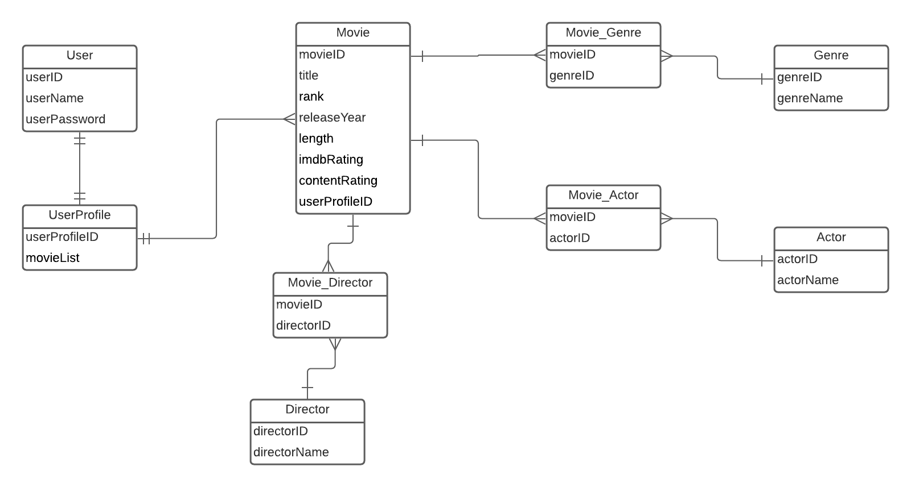

# Top Movies App

### Project Description:
This is an application where users can record and rank their favorite movies.   
The movies will include the title, the director, the release date, and the genre.   

## Machineries Used
- LucidChart (creating ERD)
- GoogleDocs (initial design collaboration)
- IntelliJ IDEA (IDE)
- SpringBoot (framework)
- Maven (dependency management)
- postgresql (database)
- pgAdmin (managing the database)
- Postman (endpoint testing)

## Design Approach

## Unsolved Problems

## Hurdles Overcome
#### Hurdle 1:
- Issue: Objects return null point exception
- Solution: Autowire
#### Hurdle 2:
- Issue: Does not know how to implement a many-to-many relationship.
- Solution: 
```
@Entity
@Table(name = "movies")
public class Movie {
    @Id
    @Column
    @GeneratedValue(strategy = GenerationType.IDENTITY)
    private Long id;

    @Column(unique = true)
    private String title;

    //LINKS TO OTHER TABLES
    
    @ManyToMany(fetch= FetchType.EAGER, cascade = {
            CascadeType.PERSIST,
            CascadeType.MERGE
    })
    @JoinTable
    private Set<Director> directors;
    
@Entity
@Table(name = "directors")
public class Director {
    @Id
    @Column
    @GeneratedValue(strategy = GenerationType.IDENTITY)
    private Long id;

    @Column
    private String directorName;

    @ManyToMany(mappedBy = "directors")
    @JsonIgnore
    private Set<Movie> movies;
```

- Figuring out how to implement a many-to-many relationship in Spring. Credit to <a href="https://stackoverflow.com/questions/42394095/many-to-many-relationship-between-two-entities-in-spring-boot/42396995" target="_blank">Stackoverflow</a>
#### Hurdle 3:
- Issue: Saving the JSON response from IMDB API
- Solution: Create a class that matches the JSON Response's properties.

#### Hurdle 4: 
- Issue: Could not delete a movie record because other tables depend on it.
- Solution: 
 ```    
  @ManyToMany(fetch=FetchType.EAGER, cascade={CascadeType.PERSIST, CascadeType.MERGE })
  @JoinTable
  private Set<Director> directors;
  ```
- Cascade type Persist and Merge allow us to keep director entities while deleting connections between movies and directors record in the join table.
## Planning Documentation

### GoogleDoc(?)

### ERD



## Endpoints:  

| Request Type | URL                       | Request Body               | Request Header              | Action                                                          | Access  |   
|--------------|---------------------------|----------------------------|-----------------------------|-----------------------------------------------------------------|---------|
| POST         | /auth/users/register      | emailAddress <br> password | Authorization: none         | registers a user                                                | PUBLIC  |
| POST         | /auth/users/login         | email <br> password        | Authorization: none         | allows a user to login                                          | PUBLIC  |
| GET          | /api/movies               |                            | Authorization: Bearer token | returns a list of all movies                                    | PRIVATE |
| POST         | /api/movies               | title <br> rank            | Authorization: Bearer token | adds a movie to the database with information from imdb-api.com | PRIVATE |
| GET          | /api/movies/{movie-id}    |                            | Authorization: Bearer token | returns a single movie                                          | PRIVATE |
| PUT          | /api/movies/{movie-id}    |                            | Authorization: Bearer token | updates an existing movie                                       | PRIVATE |
| DELETE       | /api/movies/{movie-id}    |                            | Authorization: Bearer token | removes a movie from the database                               | PRIVATE |
| GET          | /api/search/actor         | name                       | Authorization: Bearer token | returns a list of movies in which the actor appears             | PRIVATE |
| GET          | /api/search/director      | name                       | Authorization: Bearer token | returns a list of movies from the specified director            | PRIVATE | 
| GET          | /api/search/genre         | name                       | Authorization: Bearer token | returns a list of movies in the specified genre                 | PRIVATE | 
| GET          | /api/search/rating        | name                       | Authorization: Bearer token | returns a list of movies with the specified rating              | PRIVATE |
| GET          | /api/search/rank/{rankId} | name                       | Authorization: Bearer token | returns a list of movies ranked at or higher than the rank id   | PRIVATE |


## User Stories:
### MVP
-[x] As a user, I want to be able to add movies to my list of movies.
-[x] As a user, I want to be able to rank my top movies.
-[x] As a user, I want to be able to find out who directed one of my movies.
-[x] As a user, I want to be able to find out what genre my movie is in.


### SILVER
-[x] As a user, I want to be able to find my movies by genre.
-[x] As a user, I want to be able to find my movies by director.
-[x] As a user, I want to be able to list my movies in ranking order.


### GOLD
-[x] As a user, I want to be able to find my top movies based on the actor.


### PLATINUM
-[x] Based on the user’s input of a movie name, we should be able to pull details from an API so the user does not have to fill out the movie details.


## Installation Instructions
1. Fork and Clone this repository.
2. Make sure PostGreSql is installed on your computer
   1. If PostGreSQL is not installed, install the program from : https://www.postgresql.org/download/
3. Make sure pgAdmin is installed on your computer
   1. If pgAdmin is not installed, install the program from: https://www.pgadmin.org/download/
4. Open up pgAdmin and create a database called "topmoviesapp"
5. Make sure the username and password used in creation of the "topmoviesapp" database is in the repository file: "src/main/resources/application-dev.properties"
